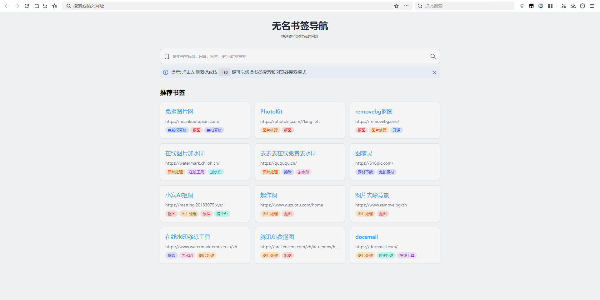

# 无名云书签

<center>新标签页预览图</center>



## 应用介绍

无名云书签是一款基于浏览器扩展的跨平台书签管理解决方案，专为解决多设备（个人电脑/公司电脑/移动设备）书签同步难题而设计。通过对接飞书开放平台 API，实现书签数据与飞书多维表格的无缝同步，无需自建服务器即可享受安全可靠的云端存储。

### 核心优势

🔐 **数据安全**：所有数据存储在您自己的飞书账户中，避免第三方服务器存储风险  
🔄 **多端同步**：支持 Chrome/Firefox/Edge 等主流浏览器，PC 与移动端数据实时同步  
📊 **多维管理**：利用飞书多维表格实现书签的标签化管理和多维数据统计  
⚙️ **灵活配置**：支持多个飞书应用和多维表格实例，实现公开/隐私书签数据隔离（你也不想在公众场合访问到不该访问的网站吧？）

### 主要功能

- **书签收藏**: 右键收藏当前网站到飞书多维表格
- **多配置支持**: 支持配置多个飞书应用和多维表格
- **书签导出**: 支持将书签导出为 JSON 或 Excel 格式，方便导入到飞书多维表格
- **搜索书签**: 新标签页快速搜索书签，提高工作效率
- **导入导出**: 支持配置的备份与恢复，轻松迁移到其他设备

### 使用场景

- 个人管理：将书签云端化，多设备同步
- 资源整理：利用飞书多维表格强大功能管理书签

## 安装使用

1. 从 Chrome 应用商店或 Firefox 附加组件商店安装扩展（暂时没有上架）
2. 在飞书开放平台创建应用，获取 API 访问凭证
3. 在扩展选项页配置飞书应用信息
4. 开始使用扩展同步和管理您的书签

### 离线安装

提供了 zip，crx 包[点击下载](https://h1pyhdrylh8.feishu.cn/docx/L6R0dm0HOoiCWmxQUNvco8J6nJd#Q3j7dzTIboGGGYxIOBbcDGhAn6o)。

详细安装教程就自己搜一下吧，懒得写了。

详细的使用说明请参考[無名云书签使用说明](https://h1pyhdrylh8.feishu.cn/docx/L6R0dm0HOoiCWmxQUNvco8J6nJd?from=from_copylink)。

## 配置说明

### 飞书配置

需要配置以下信息：

- 配置名称
- APP ID
- App Secret
- 多维表格 ID (Base ID)
- 表格 ID (Table ID)

### 其他设置

- 推荐书签数量：设置首页显示的推荐书签数量

## 开发指南

### 环境准备

```bash
# 安装依赖
npm install

# 开发模式
npm dev

# 构建扩展
npm build

# 打包扩展
npm pack
```

## 开源地址
https://github.com/wumingluren/wm-cloud-bookmark

## 开源协议

本项目采用 MIT 许可证。
